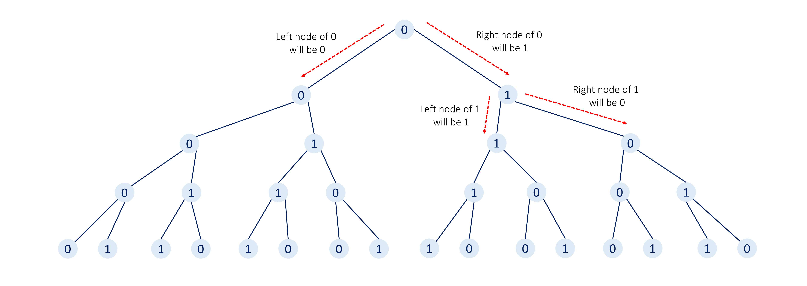
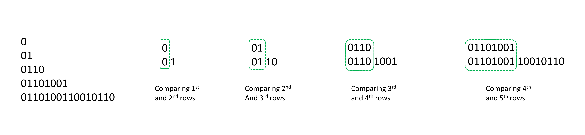
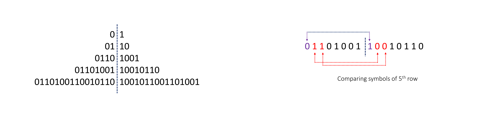

# K-th Symbol in Grammar

## We build a table of n rows (1-indexed). We start by writing 0 in the 1st row. Now in every subsequent row, we look at the previous row and replace each occurrence of 0 with 01, and each occurrence of 1 with 10

- For example, for n = 3, the 1st row is 0, the 2nd row is 01, and the 3rd row is 0110.

Given two integer n and k, return the kth (1-indexed) symbol in the nth row of a table of n rows.

```
Example 1:

Input: n = 1, k = 1
Output: 0
Explanation: row 1: 0

Example 2:

Input: n = 2, k = 1
Output: 0
Explanation:
row 1: 0
row 2: 01

Example 3:

Input: n = 2, k = 2
Output: 1
Explanation:
row 1: 0
row 2: 01

Example 4:

Input: n = 4, k = 8
Output: 1
Explanation:
row 1: 0
row 2: 01
```

### Approach - 1 Binary Tree Traversal

Intuition
Let's approach this problem as a binary tree challenge. We'll start with a single node, create two new child nodes for each node in the current row, move to the next row, and repeat the process of creating new child nodes until we have n rows in our tree.

Finally, we return the kth nodes in the nth row.

The tree we will generate is a Perfect Binary Tree with all levels completely filled.

```
Note: The number of nodes in the ith row of a perfect binary tree is given by: 2 ^ (i−1), where i=1,2,3,...
```

If the current node is 0, its left child will be 0 and the right child will be 1.

Otherwise, if the current node is 1, its left child will be 1 and the right child will be 0.

<center>
    
</center>

This approach might not be intuitive to everyone, so let's proceed gradually using an example.

### Algorithm - 1

- Create a method depthFirstSearch which takes n number of rows in the current tree, k target node position in the last row, and rootVal current tree's root's value as parameters:

  - If n is 1, then we will have a single node in our tree and this node is our target node. So, we return its value rootVal.

  - Find the number of nodes in the last row of the current tree, totalNodes, 2^(n−1)

  - If the current target node k lies in the left half of the last row of the current subtree (i.e. k <= totalNodes / 2), we will move to the left sub-tree. If the current node's value rootVal is 0 then the next node's value will be 0, otherwise, the next node's value will be 1.

    Return depthFirstSearch(n - 1, k, nextRootVal).

  - Otherwise, if the current target node k lies in the right half of the last row of the current subtree (i.e. k > totalNodes / 2), we will move to the right sub-tree.

    If the current node's value rootVal is 0 then the next node's value will be 1, otherwise, the next node's value will be 0.

    Additionally, the target's position will change to (k - (totalNodes / 2)).

    Return depthFirstSearch(n - 1, newPosition, nextRootVal).

- We return the result returned by calling depthFirstSearch(n, k, 0) with the number of rows as n, target node position k, and root node's value 0

### Solution - 1

```
let depthFirstSearch = (n, k, rootVal) => {
    if (n === 1) {
        return rootVal;
    }

    let totalNodes = Math.pow(2, n - 1);

    // Target node will be present in the right half sub-tree of the current root node.
    if (k > totalNodes / 2) {
        let nextRootVal = (rootVal === 0) ? 1 : 0;
        return depthFirstSearch(n - 1, k - (totalNodes / 2), nextRootVal);
    }
    // Otherwise, the target node is in the left sub-tree of the current root node.
    else {
        let nextRootVal = (rootVal === 0) ? 0 : 1;
        return depthFirstSearch(n - 1, k, nextRootVal);
    }
};

let kthGrammar = function(n, k) {
    return depthFirstSearch(n, k, 0);
};
```

#### Complexity - 1

Time complexity: O(n)

- With each recursive call, we reduce n by one until n becomes equal to 1. As a result, the overall time complexity is O(n).

Space complexity: O(n)

- Each recursive call will add a new frame to the stack until we reach the base case (when n becomes equal to 1). Hence, the space complexity is also O(n).

### Approach - 2 Normal Recursion

#### Intuition

```
Note: The previous approach will be sufficient during a real interview setting as these next approaches are not intuitive enough to think of them during the limited time availability. So don't get disheartened if these approaches seem hard to you. But it's recommended to read these approaches too, to have a new perspective to look at the same problem.
```

First of all, after generating a few rows using the steps given in the problem description, we can observe two patterns:

- The previous row is used as the prefix of the next row.

<center>
    
</center>

- If we divide any row into two equal halves then the symbol at each position will be opposite of each other in both halves (i.e. if we have a 0 in the left half at index i, then the right half will have a 1 at index i, and vice versa).

<center>
    
</center>

Now, these two points might seem very unintuitive to read at first, but we highly recommend you write down some examples and try to reach these observations on your own.

### Solution - 2

```
let recursion = (n, k) => {
    // First row will only have one symbol '0'.
    if (n === 1) {
        return 0;
    }

    const totalElements = Math.pow(2, n - 1);
    const halfElements = totalElements / 2;

    // If the target is present in the right half, we switch to the respective left half symbol.
    if (k > halfElements) {
        return 1 - recursion(n, k - halfElements);
    }

    // Otherwise, we switch to the previous row.
    return recursion(n - 1, k);
}

let kthGrammar = function(n, k) {
    return recursion(n, k);
};
```

#### Complexity - 2

Time complexity: O(n)

- With each recursive call, we reduce n by one until n becomes equal to 1. Thus, it will take O(n) time.

Space complexity: O(n)

- The recursive stack will also use O(n) space in the worst case.
