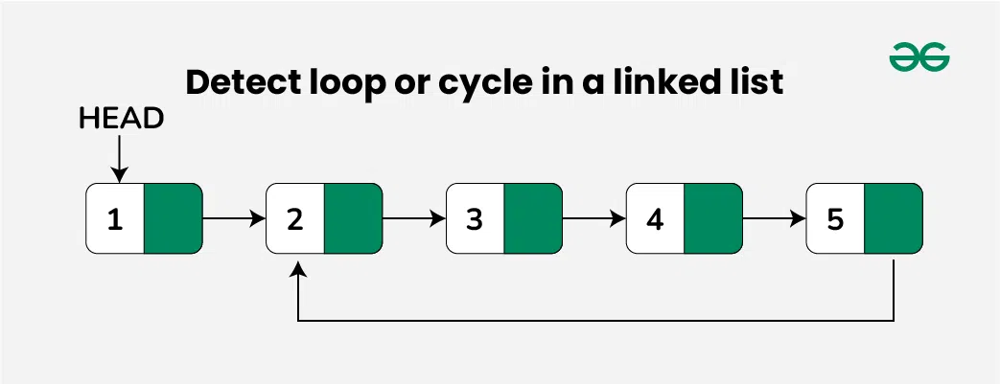
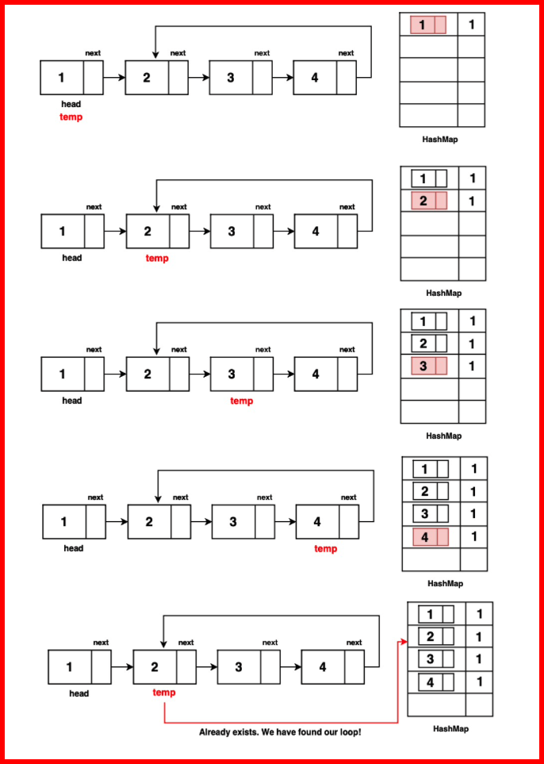

# Detect loop or cycle

Given a linked list, check if the linked list has a loop (cycle) or not. The below diagram shows a linked list with a loop.

<center>
    
</center>

## Detect loop in a linked list using Hashing (Brute Force)

```
The idea is to insert the nodes in the hashmap and whenever a node is encountered that is already present in the hashmap then return true.
```

A loop in a linked list occurs when there's a node that, when followed, brings you back to it, indicating a closed loop in the list.

Hence it's important to keep track of nodes that have already been visited so that loops can be detected. One common way to do this is by using hashing.

Follow the steps below to solve the problem:

- Traverse the list individually and keep putting the node addresses in a Hash Table.
- At any point, if NULL is reached then return false
- If the next of the current nodes points to any of the previously stored nodes in  Hash then return true.

### Algorithm / Intuition

- Step 1: Traverse through the LL using the traversal technique of assigning a temp node to the head and iterating by moving to the next element till we reach null.

- Step 2: While traversing, keep a track of the visited nodes in the map data structure.

Note: Storing the entire node in the map is essential to distinguish between nodes with identical values but different positions in the list. This ensures accurate loop detection and not just duplicate value checks.

- Step 3: If a previously visited node is encountered again, that proves that there is a loop in the linked list hence return true.

- Step 4: If the traversal is completed, and we reach the last point of the LL which is null, it means there was noloop, hence we return false.

<center>
    
</center>

```
class Solution {
    // Initialize a pointer 'temp'
    // at the head of the linked list
    let current = head;

    // Create a map to keep track of encountered nodes
    const nodeMap = new Map();

    // Step 2: Traverse the linked list
    while (current !== null) {
        // If the node is already in
        // the map, there is a loop
        if (nodeMap.has(current)) {
            return true;
        }
        // Store the current node in the map
        nodeMap.set(current, true);
        // Move to the next node
        current = current.next;
    }

    // Step 3: If the list is successfully
    // traversed without a loop, return false
    return false;
}
```

```
Time Complexity: O(N * 2 * log(N) )The algorithm traverses the linked list once, 
performing hashmap insertions and searches in the while loop for each node. 
The insertion and search operations in the unordered_map have a worst-case time complexity of O(log(N)). 
As the loop iterates through N nodes, the total time complexity is determined by the product of the traversal (O(N)) 
and the average-case complexity of the hashmap operations (insert and search), resulting in O(N * 2 * log(N)).

Space Complexity: O(N) The code uses a hashmap/dictionary to store encountered nodes, 
which can take up to O(N) additional space, where 'n' is the number of nodes in the list. 
Hence, the spacecomplexity is O(N) due to the use of the map to track nodes.
```

## Detect loop in a linked list using Floyd’s Cycle-Finding Algorithm

```
This algorithm is used to find a loop in a linked list. It uses two pointers one moving 
twice as fast as the other one. The faster one is called the faster pointer and 
the other one is called the slow pointer.
```

## Algorithm / Intuition

The previous method uses O(N) additional memory, which can become quite large as the linked list length grows. To enhance efficiency, the Tortoise and Hare Algorithm is introduced as an optimization.

The Tortoise and Hare approach has been discussed in this article.

When the tortoise and hare enter the loop, they may be at different positions within the loop due to the difference in their speeds. The hare is moving faster, so it will traverse a greater distance in the same amount of time.

If there is no loop in the linked list, the hare will eventually reach the end, and the algorithm will terminate without a meeting occurring.

### Algorithm

- Step 1: Initialise two pointers, `slow` and `fast`, to the head of the linked list. `slow` will advance one step at a time, while `fast` will advance two steps at a time. These pointers will move simultaneously.

- Step 2: Traverse the linked list with the `slow` and `fast` pointers. While traversing, repeatedly move `slow` one step and `fast` two steps at a time.

- Step 3: Continue this traversal until one of the following conditions is met:

  - `fast` or `fast.next` reaches the end of the linked list (i.e., becomes null). In this case, there is no loop in the linked list ie. the linked list is linear, and the algorithm terminates by returning false.
  - `fast` and `slow` pointers meet at the same node. This indicates the presence of a loop in the linked list, and the algorithm terminates by returning `true`.

## Intuition

In a linked list with a loop, consider two pointers: one that moves one node at a time (slow) and another that moves two nodes at a time (fast). If we start moving these pointers with their defined speed they will surely enter the loop and might be at some distance 'd' from each other within the loop.

The key insight here is the relative speed between these pointers. The fast pointer, moving at double the speed of the slow one, closes the gap between them by one node in every iteration. This means that with each step, the distance decreases by one node.

Imagine a race where one runner moves at twice the speed of another. The faster runner covers the ground faster and closes the gap, resulting in a reduction in the distance between them. Similarly, the fast pointer catches up to the slow pointer in the looped linked list, closing in the gap between them until it reaches zero.

```
class Solution {
    //Function to check if the linked list has a loop.
    detectLoop(head)
    {
        //your code here

        if(head === null || head.next === null) return false;

        let slowPtr = head;
        let fastPtr = head;

        while(fastPtr !== null && fastPtr.next !== null) {
            slowPtr = slowPtr.next;
            fastPtr = fastPtr.next.next;

            if(slowPtr === fastPtr) {
                return true;
            }
        }

        return false;
    }
}
```

```
Time Complexity: O(N), where N is the number of nodes in the linked list. 
This is because in the worst-case scenario, the fast pointer, which moves quicker, 
will either reach the end of the list (in case of no loop) or meet the slow pointer 
(in case of a loop) in a linear time relative to the length of the list.

The key insight into why this is O(N) and not something slower is that each step of the 
algorithm reduces the distance between the fast and slow pointers (when they are in the loop) 
by one. Therefore, the maximum number of steps needed for them to meet is proportional 
to the number of nodes in the list.


Space Complexity : O(1) The code uses only a constantamount of additionalspace, 
regardless of the linked list's length. This is achieved by using two pointers (slow and fast) 
to detect the loop without any significant extra memory usage, resulting in constantspace complexity, O(1).
```

## Detect loop in a linked list by Modification In Node Structure

```
The idea is to modify the node structure by adding flag in it and mark the flag whenever visit the node.
```

Follow the steps below to solve the problem:

- Have a visited flag with each node.
- Traverse the linked list and keep marking visited nodes.
- If you see a visited node again then there is a loop.

```
class Node
{
    constructor(x)
    {
        this.data = x;
        this.next = null;
        this.flag = 0;
    }
}

class Solution {
    //Function to check if the linked list has a loop.
    detectLoop(head)
    {
        if(head === null || head.next === null) return false;

        let current = head;

        while(current !== null) {
            // If this node is already traverse
            // it means there is a cycle
            // (Because you we encountering the
            // node for the second time).
            if (current.flag == 1)
                return true;

            // If we are seeing the node for
            // the first time, mark its flag as 1
            current.flag = 1;

            current = current.next;
        }

        return false;
    }
}
```

```
Time complexity: O(N), Only one traversal of the loop is needed.
Auxiliary Space: O(1)
```
