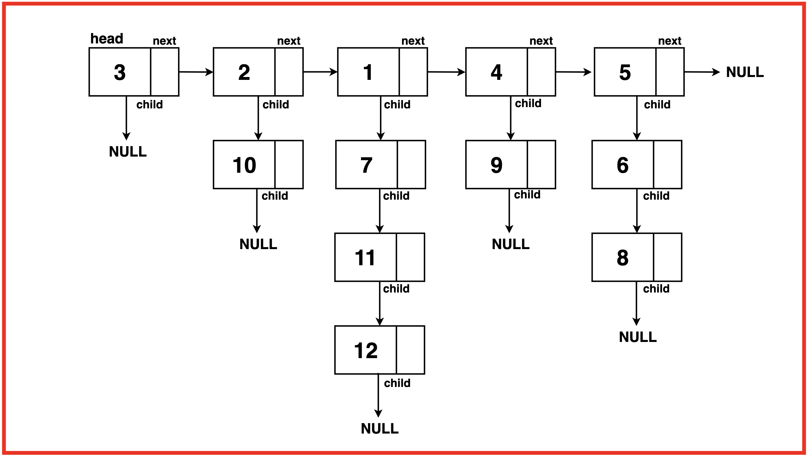
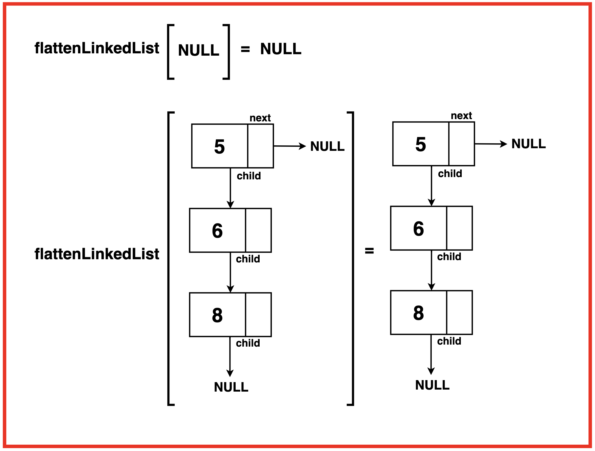
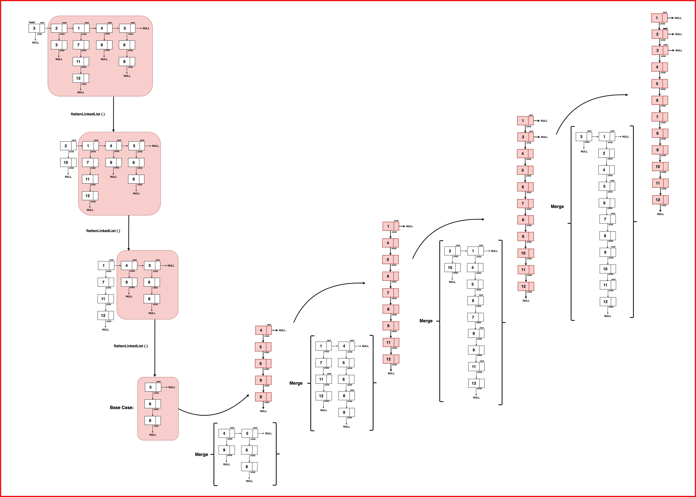
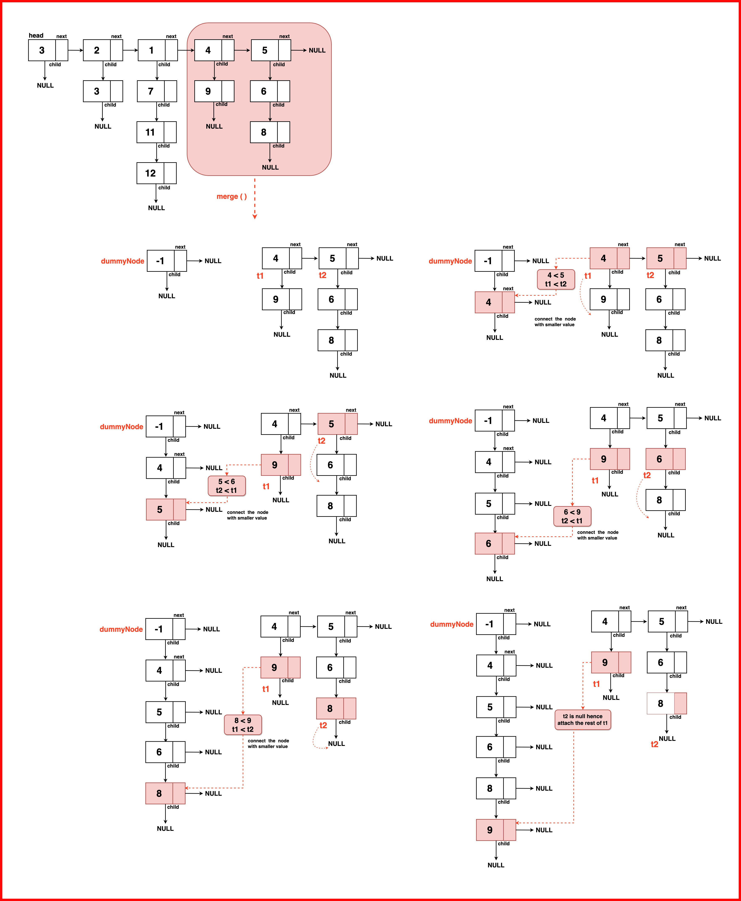

# Flattening a Linked List

Given a Linked List of size N, where every node represents a sub-linked-list and contains two pointers:
(i) a next pointer to the next node,
(ii) a bottom pointer to a linked list where this node is head.

Each of the sub-linked-list is in sorted order.
Flatten the Link List such that all the nodes appear in a single level while maintaining the sorted order.

Note: The flattened list will be printed using the bottom pointer instead of next pointer.

Note: All linked lists are sorted and the resultant linked list should also be sorted

<center>
    
</center>

Output: 1 2 3 4 5 6 7 8 9 10 11 12

Explanation: Flatten the linked list into a single level sorted order and traverse the nodes in such a manner that the child linked lists are merged into the main list in the sorted order.

## Brute Force Approach

### Algorithm / Intuition

To transform the given linked list into a single level sorted list ensuring that the nodes are arranged in an ascending order, we initialise an array to temporarily hold the extracted nodes during the traversal.

We iterate over the array by first going over the top-level next pointers of the linked list then accessing each node within its child pointers adding all to the array. Then the array is sorted to arrange all values sequentially and a new linked list from that array is created and returned.

### Algorithm

Step 1:Initialise an empty array to store the data extracted during the traversal.

Step 2: Start traversing through the top-level ‘next’ pointers of the linked list and for each node accessed by the ‘next’ pointer, traverse its ‘child’ nodes.

    - Iterate all the nodes until reaching the end of the child pointer list appending each node’s value to the array. Move to the next primary node and repeat the process of traversing the child nodes.

Step 3: Sort the array to arrange its collected node data in ascending order.

Step 4: Create a new linked list from the sorted array and return the flattened linked list.

```
/*LINKED LIST NODE
class Node {
  constructor(x){
    this.data = x;
    this.next = null;
    this.bottom = null;
  }
}
*/

/**
 * @param {Node} head
 * @return {Node}
 */
class Solution {

    // Function to convert an array to a linked list
    convertArrToLinkedList(arr) {
        // Create a dummy node to serve as
        // the head of the linked list
        let dummyNode = new Node(-1);
        let temp = dummyNode;

        // Iterate through the array and
        // create nodes with array elements
        for (let val of arr) {
            // Create a new node with the array element
            temp.bottom = new Node(val);
            // Move the temporary pointer
            // to the newly created node
            temp = temp.bottom;
        }

        // Return the linked list starting
        // from the next of the dummy node
        return dummyNode.bottom;
    }

    flatten(head) {
        let arr = [];

        // Traverse through the linked list
        while(head) {
            // Traverse through the child
            // nodes of each head node
            let current = head;

            while(current) {
                // Store each node's data in the array
                arr.push(current.data);
                // Move to the next child node
                current = current.bottom;
            }
            // Move to the next head node
            head = head.next;
        }

        // Sort the array containing
        // node values in ascending order
        arr.sort((a, b) => a - b);

        // Convert the sorted array
        // back to a linked list
        return this.convertArrToLinkedList(arr);
    }
}
```

```
Time Complexity: O(N*M) + O(N*M log(N*M)) + O(N*M)where N is the length of the linked list along the next pointer and M is the length of the linked list along the child pointer.

O(N*M) as we traverse through all the elements, iterating through ‘N’ nodes along the next pointer and ‘M’ nodes along the child pointer.
O(N*M log(N*M)) as we sort the array containing N*M (total) elements.
O(N*M) as we reconstruct the linked list from the sorted array by iterating over the N*M elements of the array.
Space Complexity : O(N*M) + O(N*M)where N is the length of the linked list along the next pointer and M is the length of the linked list along the child pointer.

O(N*M) for storing all the elements in an additional array for sorting.
O(N*M) to reconstruct the linked list from the array after sorting
```

## Optimal Approach

### Algorithm / Intuition

The time and space complexity of the previous approach can be optimised as we have not yet leveraged the given property that the child linked lists are sorted. We can eliminate the additional space and time complexity generated by sorting by using these sorted vertical linked lists.

Instead of collecting all node values into an array and then sorting them, we can merge these pre-sorted lists directly during the traversal, eliminating the need for additional sorting steps. This merge operation can be performed efficiently in place without allocating extra space for the combined linked list.

Read more about Merging Sorted Linked Lists. The base case ensures the termination of the recursion when there's either no list or only a single node remaining. The recursive function then handles the merging of the remaining lists after recursive flattening, creating a sorted flattened linked list.

### Algorithm

#### Base Case

- If the head is null, indicating the end of the list, it is already flattened or there are no further nodes. Return the head as it is.
- Similarly, if there's no next node, meaning there's only one node left in the list, return the head as it is since it's already flattened.

<center>
    
</center>

#### Recursive Function

The core of the algorithm lies in implementing a recursive function responsible for flattening the linked list. The function operates based on the principle that:

- If the base conditions are not met, the function invokes itself recursively. This recursion continues until it reaches the base case, gradually flattening the linked list and merging the resultant with the previous node.

<center>
    
</center>

### Return

Following the recursion, the function returns the merged head of the new flattened linked list. This head marks the new head of the merged list starting from the end, which will now be merged with the present head.

<center>
    
</center>

- Step 1: Establish Base Case Conditions Check if the base case conditions are met, return the head if it is null or has no next pointer to head as there’s no further flattening or merging required.

- Step 2: Recursively Merge the List:

  - Initiate the recursive flattening process by calling `flattenLinkedList` on the next node (`head -> next`).
  - The result of this recursive call is the head of the flattened and merged linked list.

Step 3: Merge Operations:

- Inside the recursive call, call the merge function which takes care of the merging of these two lists based on their data values.
- Read more about merging two linked lists here.
- The merged list is updated in the head, which is then returned as the result of the flattening process.

```
class Node {
    // Constructors to initialize the
    // data, next, and child pointers
    constructor() {
        this.data = 0;
        this.next = null;
        this.child = null;
    }

    constructor(x) {
        this.data = x;
        this.next = null;
        this.child = null;
    }

    constructor(x, nextNode, childNode) {
        this.data = x;
        this.next = nextNode;
        this.child = childNode;
    }
}

// Merges two linked lists in a
// particular order based on the data value
function merge(list1, list2) {
    // Create a dummy node as
    // a placeholder for the result
    let dummyNode = new Node(-1);
    let res = dummyNode;

    // Merge the lists based on data values
    while (list1 !== null && list2 !== null) {
        if (list1.data < list2.data) {
            res.child = list1;
            res = list1;
            list1 = list1.child;
        } else {
            res.child = list2;
            res = list2;
            list2 = list2.child;
        }
        res.next = null;
    }

    // Connect the remaining
    // elements if any
    if (list1) {
        res.child = list1;
    } else {
        res.child = list2;
    }

    // Break the last node's
    // link to prevent cycles
    if (dummyNode.child) {
        dummyNode.child.next = null;
    }

    return dummyNode.child;
}

// Flattens a linked list
// with child pointers
function flattenLinkedList(head) {
    // If head is null or there
    // is no next node, return head
    if (head === null || head.next === null) {
        return head;
    }

    // Recursively flatten the
    // rest of the linked list
    let mergedHead = flattenLinkedList(head.next);
    head = merge(head, mergedHead);
    return head;
}

// Print the linked list by
// traversing through child pointers
function printLinkedList(head) {
    while (head !== null) {
        console.log(head.data + " ");
        head = head.child;
    }
    console.log();
}

// Print the linked list
// in a grid-like structure
function printOriginalLinkedList(head, depth) {
    while (head !== null) {
        console.log(head.data);

        // If child exists, recursively
        // print it with indentation
        if (head.child) {
            console.log(" -> ");
            printOriginalLinkedList(head.child, depth + 1);
        }

        // Add vertical bars for
        // each level in the grid
        if (head.next) {
            console.log();
            for (let i = 0; i < depth; ++i) {
                console.log("| ");
            }
        }
        head = head.next;
    }
}

// Create a linked list
// with child pointers
let head = new Node(5);
head.child = new Node(14);
head.next = new Node(10);
head.next.child = new Node(4);
head.next.next = new Node(12);
head.next.next.child = new Node(20);
head.next.next.child.child = new Node(13);
head.next.next.next = new Node(7);
head.next.next.next.child = new Node(17);

// Print the original linked list structure
console.log("Original linked list:");
printOriginalLinkedList(head, 0);

// Flatten the linked list
// and print the flattened list
let flattened = flattenLinkedList(head);
console.log("\nFlattened linked list: ");
printLinkedList(flattened);
```

```
Time Complexity: O( N*(2M) ) ~ O(2 N*M)where N is the length of the linked list along the next pointer and M is the length of the linked list along the child pointers.

The merge operation in each recursive call takes time complexity proportional to the length of the linked lists being merged as they have to iterate over the entire lists. Since the vertical depth of the linked lists is assume to be M, the time complexity for a single merge operation is proportional to O(2*M).
This operation operation is performed N number of times (to each and every node along the next pointer list) hence the resultant time complexity becomes: O(N* 2M).
Space Complexity : O(1) as this algorithm uses no external space or additional data structures to store values. But a recursive stack uses O(N) space to build the recursive calls for each node along the next pointer list.
```
