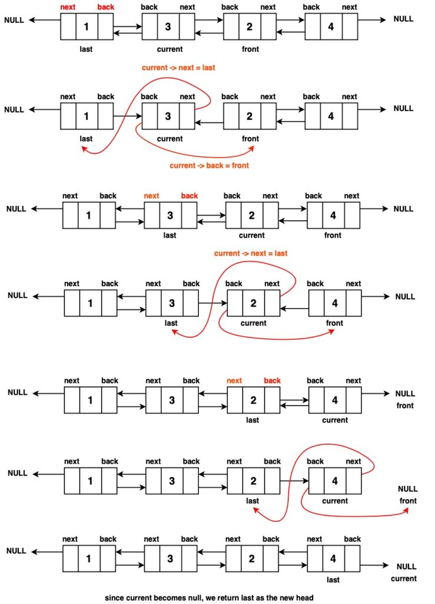

# Reverse a Double Linked List

Given a Doubly Linked List, the task is to reverse the given Doubly Linked List.

Examples:

```
Input:
LinkedList: 3 <--> 4 <--> 5
Output: 5 4 3

Input:
LinkedList: 75 <--> 122 <--> 59 <--> 196
Output: 196 59 122 75
```

## Reverse a linked list using Stack (Brute Force)

```
Algorithm / Intuition

A brute-force approach involves replacing data in a doubly linked list. 
First, we traverse the list and store node data in a stack. 
Then, in a second pass, we assign elements from the stack to nodes, ensuring a reverse order replacement 
since stacks follow the Last-In-First-Out (LIFO) principle.
```

Follow the given steps to solve the problem using the above approach:

- Traverse the whole Linked List and  Keep pushing the node’s data into the stack
- Then keep popping the elements out of the stack and updating the Doubly Linked List

### Algorithm

- Step 1: Initialization a temp pointer to the head of the doubly linked list and a stack data structure to store the values from the list.
- Step 2: Traverse the doubly linked list with the temp pointer and while traversing push the value at the current node temp onto the stack. Move the temp to the next node continuing until temp reaches null indicating the end of the list.
- Step 3: Reset the temp pointer back to the head of the list and in thissecond iteration pop the element from the stack, replace the data at the current node with the popped value from the top of the stack and move temp to the next node. Repeat this step until temp reaches null or the stack becomes empty.

```
class Solution {

  reverseDLL(head){
      //code here

      if(head === null || head.next === null) return head;

      let s = [];

      let current = head;

      while(current !== null) {
          s.push(current.data);

          current = current.next;
      }

      current = head;

      while(s.length !== 0) {
          current.data = s.pop();

          current = current.next;
      }

      return head;
  }
}
```

```
Time Complexity : O(2N) During the first traversal, each node's value is pushed into the stack once, which requires O(N) time. 
Then, during the second iteration, the values are popped from the stack and used to update the nodes.
Space Complexity : O(N) This is because we are using an external stack data structure. At the end of the first iteration, 
the stack will hold all N values of the doubly linked list therefore the space required for stack is directly proportional 
to the size of the input doubly linked list.
Auxiliary Space: O(N)
```

## Reverse the Links in a Single Traversal (Optimal)

Instead of performing two separate traversals of the linked list and storing its node values in an external data structure, we can optimize our approach by directly modifying the links between the nodes within the doubly linked list in place, as visualized below:

### Algorithm

- Step 1: Initialise two pointers that are needed for the reversal. Initialize a current pointer to the head of the linked list. This pointer will traverse the list as we reverse it. Initialize a second pointer last to null. This pointer will be used for temporary storage during pointer swapping, as we need a third variable while swapping two data.

- Step 2: Traverse through the DLL by looping over all the nodes..

- Step 3: While iterating over all nodes in the linked list, we make changes to set the backward pointer of a node to the next changing its previous link. Along with this, the forward pointer is adjusted to point to the previous node, reversing the next link. To prevent losing the last node in this process, we use a reference to the last node to retain it.
  - Update the current node's back pointer to point to the next node (current->back = current->next). This step reverses the direction of the backward pointer.
  - Update the current node's next pointer to point to the previous node (current->next = last). This step reverses the direction of the forward pointer.
  - Move the current pointer one step forward (current = current->back). This allows us to continue the reversal process.
- Step 4: After completing the traversal, the last node ends up at the second node in the reversed doubly linked list. To obtain the new head of the reversed list, we simply use the backward pointer of the last node, which points to the new head.

To ensure that we handle the case where the traversal ended at the original list's end (i.e., the last pointer is not null), we update the head pointer to point to the new head of the reversed list, which is stored in the last pointer.

Finally, we return the head pointer, now pointing to the head of the fully reversed doubly linked list.

<center>
    
</center>

```
class Solution {
    //Function to reverse a linked list.
    reverseList(head) {
        // Check if the list is empty
        // or has only one node
        if (head === null || head.next === null) {
            // No change is needed;
            // return the current head
            return head;
        }

        // Initialize a pointer to
        // the previous node
        let prev = null;

        // Initialize a pointer
        // to the current node
        let current = head;

        // Traverse the linked list
        while (current !== null) {
            // Store a reference to
            // the previous node
            prev = current.prev;

            // Swap the previous
            // and next pointers
            current.prev = current.next;

            // This step reverses the links
            current.next = prev;

            // Move to the next node
            // in the original list
            current = current.prev;
        }

        // The final node in the original
        // list becomes the new head after reversal
        return prev.prev;
    }
}
```

```
Time Complexity : O(N) We only have to traverse the doubly linked list once, hence our time complexity is O(N).

Space Complexity : O(1), as the reversal is done in place.
```
