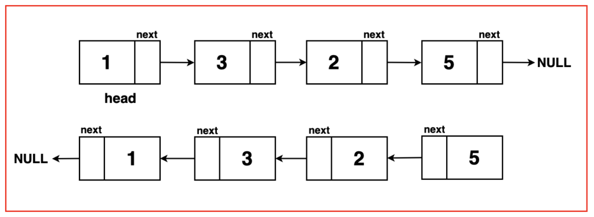
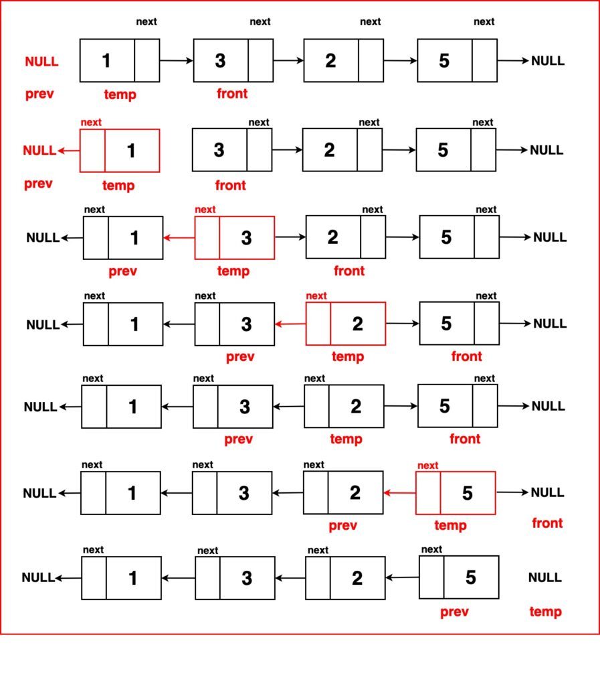
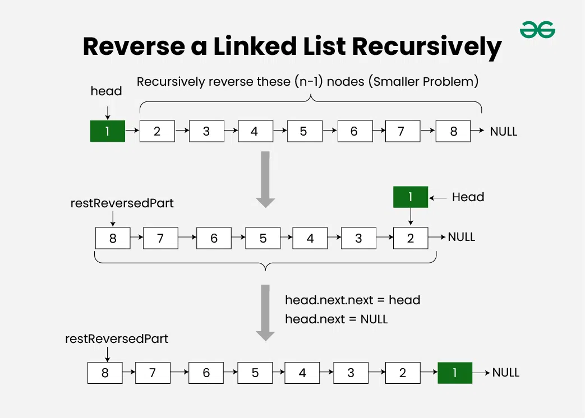
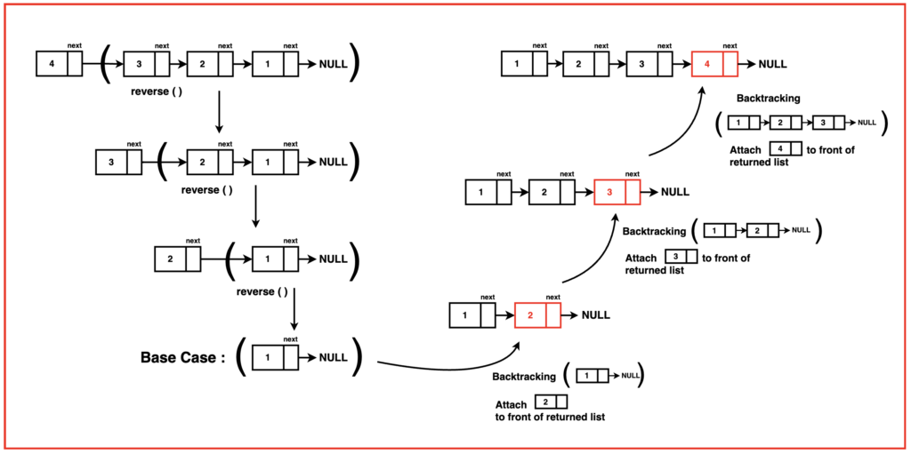

# Reverse a Linked List

Given a pointer to the head node of a linked list, the task is to reverse the linked list. We need to reverse the list by changing the links between nodes.

Examples:

```
Input: Head of following linked list
1->2->3->4->NULL
Output: Linked list should be changed to,
4->3->2->1->NULL

Input: Head of following linked list
1->2->3->4->5->NULL
Output: Linked list should be changed to,
5->4->3->2->1->NULL

Input: NULL
Output: NULL

Input: 1->NULL
Output: 1->NULL
```

## Reverse a linked list using Stack (Brute Force)

```
The idea is to store the all the nodes in the stack then make a reverse linked list.
```

Follow the steps below to solve the problem:

- Store the nodes(values and address) in the stack until all the values are entered.
- Once all entries are done, Update the Head pointer to the last location(i.e the last value).
- Start popping the nodes(value and address) and store them in the same order until the stack is empty.
- Update the next pointer of last Node in the stack by NULL.

```
class Solution {
    //Function to reverse a linked list.
    reverseList(head) {
        if (head === null || head.next === null) return head;

        let s = [];

        let current = head;

        while (current.next != null) {
            s.push(current);
            current = current.next;
        }

        head = current;

        while (s.length != 0) {
            current.next = s.pop();

            current = current.next;
        }

        current.next = null;

        return head;
    }
}
```

```
Time Complexity: O(N), Visiting every node of the linked list of size N.
Auxiliary Space: O(N), Space is used to store the nodes in the stack.
Space Complexity: O(N) We use a stack to store the values of the linked list, and in the worst case, the stack will have all N values,  ie. storing the complete linked list.
```

## Reverse a linked list by Iterative Method

The main idea is to flip the order of connections in the linked list, which changes the direction of the arrows. When this happens, the last element becomes the new first element of the list. This in-place reversal allows us to efficiently transform the original list without using extra space.

<center>
    
</center>

The idea is to use three pointers curr, prev, and next to keep track of nodes to update reverse links.

<center>
    
</center>

```
class Solution {
    //Function to reverse a linked list.
    reverseList(head) {
        // Initialize pointer 'temp' at
        // head of the linked list
        let temp = head;

        // Initialize a pointer 'prev' to null
        // representing the previous node
        // (initially none)
        let prev = null;

        // Traversing the list, continue until
        // 'temp' reaches the end (null)
        while (temp !== null) {
            // Store the next node in
            // 'front' to preserve the reference
            let front = temp.next;

            // Reverse direction of current node's
            // 'next' pointer to point to 'prev'
            temp.next = prev;

            // Move 'prev' to the current node,
            // preparing it for the next iteration
            prev = temp;

            // Move 'temp' to the 'front' node
            // (the next node), advancing traversal
            temp = front;
        }
        // Return the new head of
        // the reversed linked list
        return prev;
    }
}
```

```
Time Complexity: O(N) The code traverses the entire linked list once, where 'n' is the number of nodes in the list. This traversal has a linear time complexity, O(n).

Space Complexity: O(1) The code uses only a constant amount of additional space, regardless of the linked list's length. This is achieved by using three pointers (prev, temp and front) to reverse the list without any significant extra memory usage, resulting in constant space complexity, O(1).
```

## Reverse a linked list using Recursion

```
The idea is to reach the last node of the linked list using recursion then start reversing the linked list.
```

<center>
    
</center>

Follow the steps below to solve the problem:

- Divide the list in two parts – first node and rest of the linked list.
- Call reverse for the rest of the linked list.
- Link the rest linked list to first.
- Fix head pointer to NULL

<center>
    
</center>

### Steps

- Step 1: Establish Base Case Conditions: Check if the linked list is either empty or contains only one node. If so, the list is already reversed; hence, return the head as is.

- Step 2: Recursively Reverse the List: Begin the recursive step by reversing the linked list, starting from the second node. Utilise a recursive call to the reverse linked list function, passing the next node as an argument.

- Step 3: Preserve Access to Remaining Nodes: To maintain access to the rest of the linked list while reversing the order, store a reference to the node following the current 'head' node. This step ensures continuity in the link sequence during reversal.

- Step 4: Reverse Link Direction: Adjust the 'front' node to point to the current 'head' node in the reversed order. This action effectively reverses the link between the 'head' node and the 'front' node.

- Step 5: Prevent Cyclic References: Break the link from the current 'head' node to the 'front' node to prevent any cyclic formations. Set 'head->next' to 'NULL' to ensure the reversed segment of the list does not create a loop.

- Step 6: Return the New Head: Finally, return the 'newHead,' which signifies the new head of the reversed linked list. This 'newHead' was initially the last node in the list before the reversal commenced.

```
class Solution {
    //Function to reverse a linked list.
    reverseList(head) {
        // Base case:
        // If the linked list is empty or has only one node,
        // return the head as it is already reversed.
        if (head === null || head.next === null) {
            return head;
        }

        // Recursive step:
        // Reverse the linked list starting
        // from the second node (head.next).
        var newHead = reverseLinkedList(head.next);

        // Save a reference to the node following
        // the current 'head' node.
        var front = head.next;

        // Make the 'front' node point to the current
        // 'head' node in the reversed order.
        front.next = head;

        // Break the link from the current 'head' node
        // to the 'front' node to avoid cycles.
        head.next = null;

        // Return the 'newHead,' which is the new
        // head of the reversed linked list.
        return newHead;
    }
}
```

```
Time Complexity: O(N) This is because we traverse the linked list twice: once to push the values onto the stack, and once to pop the values and update the linked list. Both traversals take O(N) time.

Space Complexity : O(1) No additional space is used explicitly for data structures or allocations during the linked list reversal process. However, it's important to note that there is an implicit use of stack space due to recursion. This recursive stack space stores function calls and associated variables during the recursive traversal and reversal of the linked list. Despite this, no extra memory beyond the program's existing execution space is allocated, hence maintaining a space complexity of O(1).
```

## Reverse a linked list by Tail Recursive Method

```
The idea is to maintain three pointers previous, current and next, recursively visit every node and make links using these three pointers.
```

Follow the steps below to solve the problem:

- First update next with next node of current i.e. next = current->next
- Now make a reverse link from current node to previous node i.e. curr->next = prev
- If the visited node is the last node then just make a reverse link from the current node to previous node and update head.

```
class Solution {
    //Function to reverse a linked list.
    reverseList(head) {
        /* If head is initially null OR list is empty */
        if (head == null)
            return head;

        /* If last node mark it head */
        if (curr.next == null) {
            head = curr;

            /* Update next to prev node */
            curr.next = prev;
            return head;
        }

        /* Save curr->next node for recursive call */
        var next1 = curr.next;

        /* and update next .. */
        curr.next = prev;

        reverseList(next1, curr);
        return head;
    }
}
```

```
Time Complexity: O(N), Visiting every node of the linked list of size N.
Auxiliary Space: O(N), Function call stack space
```
