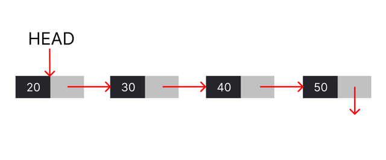
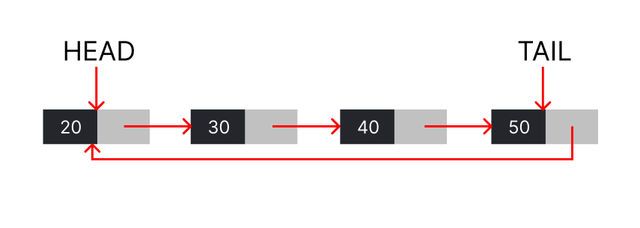

# Linked List - Concept

Linked list is a linear data structure where each element is a separate object connected to each other and is similar to Arrays.

<center>
    
</center>

As you can see in the image, we maintain the Head pointer of the linked list and each node contains two fields:

- Value (Integer)
- Pointer to next node

The last node of a linked list is called Tail. The Tail's next pointer is NULL address indicating there is no element after it.

## Primary Operations

- Insertion: Inserting an element at end/beginning or in the middle at some kth position.
- Deletion : Deleting an element from the list.
- Display : Traversing the whole linked list and output each element.

## Implementation

We use a Node class for each node of the linked list.

```
class Node {
    constructor(val) {
        this.value = val;
        this.next = null;
    }
}

// Creating head of the Linked list
const head = new Node(1);
```

## Linked List - Operations

The primary operations which we do on a linked list are:

- Insertion: Inserting an element at end/beginning or in the middle at some k-th position.
- Deletion: Deleting an element from the list.
- Display: Traversing the whole linked list and output each element.

Because linked list is a basic data structure, you can do many more operations on it as required. But these three are enough to start.

### Insertion in Linked List

Let's learn about inserting new elements at the beginning of a linked list.

Now, suppose we have a linked list 1 -> 2 -> 3 and we want to insert 4 at the beginning. We can then the follow the steps:

- Step - 1: Create a new node with value 4. Let's call it newNode.

<center>
    
</center>

- Step - 2: Add the head of the existing linked list as the next of newNode.

<center>
    
</center>

- Step - 3: Then set the head variable to the newNode, as the newNode is our new head.

<center>
    
</center>

#### Implementation

To implement insertion operation, we have to create a new class LinkedList and create a new method insertFront in it.

We have also added getHeadValue to get the value at head after insertion.

```
class Node {
    constructor(val) {
        this.value = val;
        this.next = null;
    }
}

class LinkedList {
    constructor() {
        this.head = null;
    }

    insertFront(value) {
        // Step 1: Create a new Node
        const newNode = new Node(value);

        // Step 2: Set next of newNode to the current head
        newNode.next = this.head;

        // Step 3: Set newNode as the head
        this.head = newNode;
    }

    getHeadValue() {
        if (this.head === null) {
            return -1;
        } else {
            return this.head.value;
        }
    }
}

(function() {
    const list = new LinkedList();
    list.insertFront(3);
    console.log("The value at the head is: " + list.getHeadValue());

    list.insertFront(2);
    console.log("The value at the head is: " + list.getHeadValue());
})();
```

### Linked List - Insertion at end

Insertion at end is fairly straightforward.

See the following steps:

- Make a new node with the desired value.
- Start at the head and move to the last node of the linked list.
- Insert the new node after the last node.

The only edge case is when there is no value in the linked list. In that case, we set the head of the linked list to the new node.

#### Implementation

```
// This is the node class which is instantiated whenever we add a new element to the list
class Node {
    constructor(value) {
        this.value = value;
        this.next = null;
    }
}

// Head pointer is stored to maintain the beginning of the list
class LinkedList {
    constructor() {
        this.head = null; // NULL because initially the list is empty
    }

    insertAtEnd(value) {
        const newNode = new Node(value);

        if (this.head === null) {
            // The list is empty, thus we just need to assign head to the only element
            this.head = newNode;

        } else {
            let currentNode = this.head;

            // Iterating towards the end of the list
            while(currentNode.next !== null) {
                currentNode = currentNode.next;
            }

            // Updating the next pointer of this element
            currentNode.next = newNode;
        }
    }

    print() {
        let temp = this.head;
        while (temp !== null) {
            process.stdout.write(`${temp.value} `);
            temp = temp.next;
        }
    }
}

(function() {
    const list = new LinkedList();

    list.insertAtEnd(1);
    list.insertAtEnd(2);
    list.insertAtEnd(3);

    console.log("The value at the head is: " + list.print());
})();
```

### Linked List - Insertion at k-th position

In the last two lessons, we saw how to insert at the start and end of a linked list. How about inserting after some k-th node in the linked list?

The approach is similar to inserting at the end, but rather than going to the end of the list, we will just iterate to the k-th node.

To insert a node in between the k and k+1 node, we will have to change the next pointer of both the k-th node and new Node.

- Set next of new Node to next of current
- Set next of current to new Node

#### Implementation

```
class LinkedList {
    constructor() {
        this.head = null;
    }

    insertAfterK(value, k) {
        const newNode = new Node(value);

        // If there are no nodes in the linked list
        // Set the new node as head and return
        if (this.head === null) {
            this.head = newNode;
            return;
        }

        let current = this.head;

        if (k === 0) {
            newNode.next = this.head;
            this.head = newNode;
            return;
        }
        // Iterate to the k-th node
        for (let i = 1; i < k; i++) {
            if (current.next === null) break;
            current = current.next;
        }

        // Set the next of new Node to next of current
        newNode.next = current.next;


        // Set the next of current to new Node
        current.next = newNode;
    }
}
```

#### Time Complexity

The time complexity of insertion at end is thus O(N) where N is the size of the linked list. But we can make it O(1).

How?

### Optimal insertion at the end

By maintaining a tail pointer, which will point to the last element of the linked list. Thus whenever we want to insert at the end, we can use tail for that.

#### Implementation

```
class LinkedList {
    constructor() {
        this.head = null;

        // Create the Node tail
        this.tail = null;
    }

    insertAtEnd(value) {
        const newNode = new Node(value);

        // If there are no nodes in the linked list
        // Set the new node as head and tail
        if (this.head === null) {
            this.head = newNode;
            this.tail = newNode;
            return;
        }

        // Set next of tail to the new Node
        this.tail.next = newNode;

        // Set new Node as the new tail
        this.tail = newNode;
    }
}
```

## Circular Linked List

In a Circular Linked-list, as the name suggests, all nodes are connected to form a circle. The first node and the last node are connected to each other which forms a circle. There is no null at the end.

<center>
    
</center>

Some important points regarding circular linked-list:

- Starting from any node, you can traverse the whole list.
- An additional tail pointer is maintained which helps us in operations to be performed at the last element easily.
- Very useful in programs where we need to repetitively iterate the list.
- The structure of each node is still same as singly linked list, i.e, value and next pointer.

Note: We will maintain the head and tail pointer both for ease of understanding, but maintaining the head pointer is not required since you could always access it using next pointer of tail.

### Insertion at end in Circular Linked List

Let's learn how to insert an element at the end of circular linked list.

Whenever inserting a new node, there can be two cases:

- The list is empty (head = null) - Simply assign both head and tail as the new node and update the next pointer of tail.

- The list is not empty

  - The new node is supposed to be added after tail, thus set next of tail to new node.
  - Update the tail to new node because now it is the last element.
  - Update the next of new tail to existing head.

```
/*
class Node {
    constructor(value) {
        this.value = value;
        this.next = null;
    }
}

class MyCircularList {
    constructor() {
        this.head = null;
        this.tail = null;
    }
}
*/
MyCircularList.prototype.insertAtEnd = function(value) {
    const newNode = new Node(value);

    if (this.head === null) {

        // When the list is empty
        // Note that even though there is not really a head in the list (you can traverse the list starting at any point), we maintain the first node we insert as the head
        this.head = newNode;
        this.tail = newNode;

    } else {
        // When the list is not empty
        // Adding a new element towards the end of list

        // Updating the tail pointer so that it points to the last element

        newNode.next = this.head;

        this.tail.next = newNode;

        this.tail = newNode;

    }
    // The last element always points to the head
}
```

### Deletion in Circular Linked List

Let's learn how to delete an element given it's value from a Circular Linked-list.

The steps to delete a node with value are very similar to that of Singly Linked-list.

There are two cases:

- The list only contains one element (head = tail) and it is the element to be deleted: Assign both head and tail as null (Yes, that's it).

- Otherwise :

  - Check if the first value is the value to be deleted
    - If yes, set head to second element and set tail's next to the new head
- Now iterate over the linked list till you reach the tail
  - check if the next node is target
    - If it is, set current node's next to the next of the next node and break.

```
/*
class Node {
    constructor(value) {
        this.value = value;
        this.next = null;
    }
}

class LinkedList {
    constructor() {
        this.head = null;
        this.tail = null;
    }
}
*/
LinkedList.prototype.deleteNode = function(value){
    // If there is only one element and it is the value to be deleted, remove it
    if (this.head === this.tail && this.head.value === value) {
        this.head = null;
        this.tail = null;
        return;
    }
    // If the target is at head, set head to the second element and set tail's next to the new head
    let iter = this.head;
    if (this.head.value === value) {
        this.head = this.head.next;
        this.tail.next = this.head;
        return;
    }

    // Iterate over the linked list until you reach the tail and check if the next node is target
    while (iter.next !== null && iter !== this.tail) {
        if (iter.next.value === value) {
            // If we found the value
            // Set current node's next to the next of the next node
            iter.next = iter.next.next;

            break;


            // And break
        }
        iter = iter.next;
    }
}
```

### Introduction - Doubly Linked List

Doubly linked list, an extension of singly linked list allows us to store not only a next pointer, but also a previous pointer. Therefore, every node points to it's next and previous node.

This provides us benefits like traversing back and forth but the trade-off is extra space. We need to maintain an extra pointer for every node.

The structure of the node now is:

- Datatype value
- node next
- node prev

Note - The prev pointer of head is null and the next pointer of the tail is null.

Some applications of Doubly Linked List are:

- Implementing LRU (Least Recently Used) cache algorithm
- Used in applications where undo redo use-cases are applicable
- Deletion operation in O(1) time using map.

#### Insertion in Doubly Linked List

In this section, we will learn how to do the insertion operation in a doubly linked list.

Let's suppose you need to insert a node newNode between node A and node B, the pointers we need to update are:

- next pointer of A
- prev pointer of B
- next and prev pointer of newNode

```
/*
class Node {
    constructor(value) {
        this.value = value;
        this.next = null;
        this.prev = null;
    }
}

class LinkedList {
    constructor() {
        this.head = null;
    }
}
*/
LinkedList.prototype.insertAtIndex = function(index, value){
  const newNode = new Node(value);

  if (index === 0) {
    // To insert at head, make this new node the head
    newNode.next = this.head;

    if (this.head !== null) {
      this.head.prev = null;
    }
    this.head = newNode;
  } else {
    // To insert at any other position
    // Find the nodes between which we want to insert
    // By traversing from head to index - 1 position
    let iter = this.head;
    for (let i = 0; i < index - 1; i++) {
      iter = iter.next;
    }

    const A = iter;
    const B = iter.next;

    // Update pointers to insert newNode between A and B
    A.next = newNode;
    if (B !== null) {
      B.prev = newNode;
    }

    // Update pointers of newNode
    newNode.next = B;
    newNode.prev = A;
  }
}
```

#### Deletion - Doubly Linked List

In this section, we will learn how to do the deletion operation in a doubly linked list.

Let's suppose you need to delete the node target between node A and node B, the pointers we need to update are:

- next pointer of A
- prev pointer of B
- head pointer if target is the head

```
/*
class Node {
    constructor(value) {
        this.value = value;
        this.next = null;
        this.prev = null;
    }
}

class LinkedList {
    constructor() {
        this.head = null;
    }
}
*/
LinkedList.prototype.deleteNode = function (value) {
  let targetNode = this.head;
  while (targetNode !== null && targetNode.value !== value) {
    targetNode = targetNode.next;
  }

  if (targetNode === null) return;

  // Update A and B
  const A = targetNode.prev;
  const B = targetNode.next;

  // A could be null if target is head
  if (A !== null) {
    A.next = B;
  }

  // B could be null if target is tail
  if (B !== null) {
    B.prev = A;
  }

  if (targetNode === this.head) {
    this.head = B;
  }
}
```
